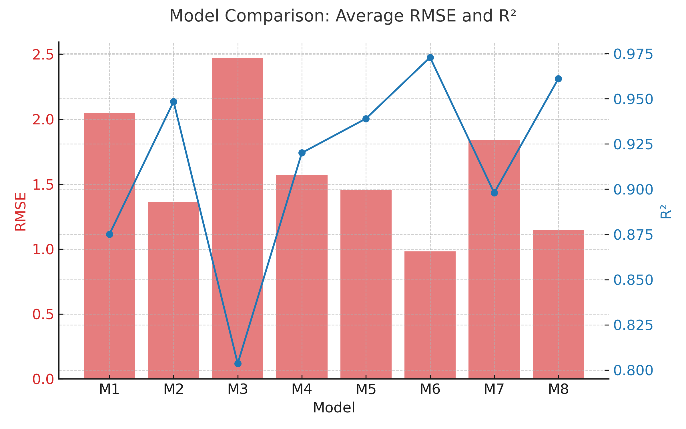
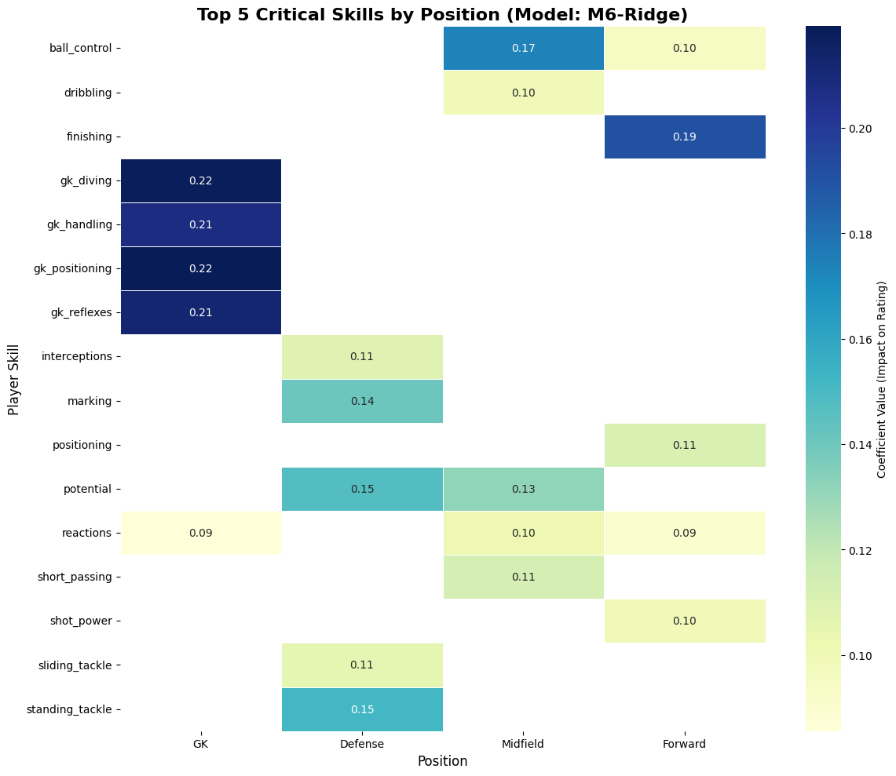

# Player Position & Rating Prediction

This project uses the **European Soccer Database (SQLite)** to:

1. Extract players' **average on-field coordinates** from matches.
2. Generate position labels using **K-Means** and **rule-based** methods (4 general roles, 7 detailed roles).
3. Predict players' **overall rating** using position-enriched features with Ridge, ElasticNet, RandomForest, and XGBoost regressors.
4. Create visualizations for model outputs and **feature importances**.

Project pipeline: position detection → position-aware rating prediction → evaluation and visualization

> Code is packaged with a `src/` layout. Command-line entry points live under `scripts/`.

---

## 📂 Project Structure

```
player-position-and-rating-prediction/
├─ README.md
├─ requirements.txt
├─ pyproject.toml
├─ figs/                          # All generated plots for README/paper
│   ├─ model_comparison.png
│   └─ feature_importance.png
├─ data/                          # Intermediate parquet files (generated by scripts)
├─ runs/                          # Model results (generated by training)
├─ scripts/
│   ├─ build_positions.py         # Match → avg_X/avg_Y parquet
│   ├─ label_positions.py         # KMeans labels → parquet
│   ├─ merge_player_data.py       # Join attributes with positions
│   ├─ add_rule_labels.py         # Add rule-based position labels
│   ├─ train_models.py            # Train M1–M8 × regressors
│   ├─ evaluate_models.py         # Summarize RMSE & R²
│   └─ feature_importance.py      # Export per-position feature importances (CSV)
└─ src/soccer_rating/
    ├─ data/                      # SQLite reading, parquet I/O
    ├─ features/                  # Average coordinate calculations
    ├─ labeling/                  # KMeans and rule-based labeling
    ├─ modeling/                  # Model training code
    ├─ evaluation/                # Metric calculation
    └─ viz/
        └─ plots.py                # Plotting helpers
```

---

## 📊 Model Configurations (M1–M8)

| Model | Label | Role Level | Feature Set |
|---|---|---|---|
| M1 | kmeans_position_label | General (4 roles) | Selected |
| M2 | kmeans_position_label | General | All |
| M3 | kmeans_detailed_position | Detailed (7 roles) | Selected |
| M4 | kmeans_detailed_position | Detailed | All |
| M5 | rule_position_label | General | Selected |
| M6 | rule_position_label | General | All |
| M7 | rule_detailed_position | Detailed | Selected |
| M8 | rule_detailed_position | Detailed | All |

---

## 🔍 Step-by-Step Workflow

### 1. Extract Average Coordinates → `data/positions.parquet`
```bash
python scripts/build_positions.py --sqlite <path_to_database.sqlite> --out data/positions.parquet
```
- Computes per-player average `avg_X` and `avg_Y` positions from `home/away_player_Xi/Yi` columns in the `Match` table.

### 2. Position Labeling with K-Means → `data/labels.parquet`
```bash
python scripts/label_positions.py --positions data/positions.parquet --out data/labels.parquet
```
- Runs KMeans (n_clusters=4 and n_clusters=7) to produce **general** (`kmeans_position_label`) and **detailed** (`kmeans_detailed_position`) labels.

### 3. Merge with Player Attributes → `data/player_data.parquet`
```bash
python scripts/merge_player_data.py --sqlite <path_to_database.sqlite> --positions data/labels.parquet --out data/player_data.parquet
```
- Merges with the most recent `Player_Attributes` records to obtain features.

### 4. Rule-Based Labeling → `data/player_data_rule.parquet`
```bash
python scripts/add_rule_labels.py --data_in data/player_data.parquet --data_out data/player_data_rule.parquet
```
- Uses rule-based functions to create **general** (`rule_position_label`) and **detailed** (`rule_detailed_position`) labels.

### 5. Model Training → `runs/<run_name>/results.csv`
```bash
python scripts/train_models.py --data data/player_data_rule.parquet --out runs/local_test
```
- Trains position-specific regressors for all M1–M8 configurations and 4 different regressors.

### 6. Model Evaluation (Console Output)
```bash
python scripts/evaluate_models.py --runs_dir runs
```
- Outputs weighted average RMSE and R² scores for each model.

### 7. Feature Importance Calculation → `figs/feature_importance_M6.csv`
```bash
python scripts/feature_importance.py --data data/player_data_rule.parquet --out figs --model M6
```
- For the selected model (default Ridge), computes per-position coefficients or feature importances.

---

## 📊 Visualization

All plotting helpers are in `src/soccer_rating/viz/plots.py`. **They only save when `save_path` is provided** and always return a matplotlib `Figure`.

### Scatter Plot of Positions
```python
from soccer_rating.viz.plots import scatter_positions
scatter_positions(position_df, save_path="figs/positions_scatter.png")
```

### Model Comparison Chart (from results.csv)
```python
import pandas as pd
from soccer_rating.viz.plots import bar_model_summary
df = pd.read_csv("runs/local_test/results.csv")
bar_model_summary(df, save_path="figs/model_comparison.png")
```

### Feature Importance Heatmap
```python
from soccer_rating.viz.plots import feature_importance_heatmap
feature_importance_heatmap("figs/feature_importance_M6.csv",
                           model_id="M6-Ridge",
                           top_n=5,
                           save_path="figs/feature_importance.png")
```

Example outputs:


*Model comparison*


*Top features by position*

---

## 🛠 Setup

```bash
# Create virtual environment
python -m venv .venv
source .venv/bin/activate   # Linux/macOS
.venv\Scripts\Activate.ps1  # Windows PowerShell

# Install dependencies
pip install -r requirements.txt

# Install the package in editable mode (for src layout)
pip install -e .
```

---

## 🚀 Example Run (Windows PowerShell)
```powershell
$Env:ESD_SQLITE="C:\path\to\database.sqlite"

python scripts\build_positions.py   --sqlite $Env:ESD_SQLITE --out data\positions.parquet
python scripts\label_positions.py   --positions data\positions.parquet --out data\labels.parquet
python scripts\merge_player_data.py --sqlite $Env:ESD_SQLITE --positions data\labels.parquet --out data\player_data.parquet
python scripts\add_rule_labels.py   --data_in data\player_data.parquet --data_out data\player_data_rule.parquet
python scripts\train_models.py      --data data\player_data_rule.parquet --out runs\local_test
python scripts\evaluate_models.py   --runs_dir runs
python scripts\feature_importance.py --data data\player_data_rule.parquet --out figs --model M6
```

---

## 📄 Related Documents

- **[Project Report](docs/project_report.pdf)** → Main paper with methodology, experiments, and results.  
- **[Appendix](docs/project_appendix.pdf)** → Additional figures, tables, and extended data.

These files are included in the repository for reference and further reading.

> The `figs/` folder contains visual outputs matching the examples shown in the README.
